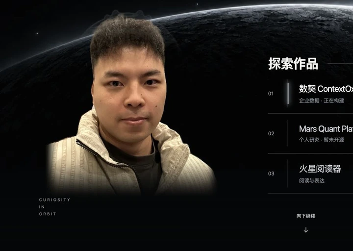

<div align="center">

# RACING HELMET MOTION

### 赛车头盔动态人像 · Interactive Portrait Agent Skill

**保留真实的人，让头盔与光影开始流动**<br>
**Keep the person real. Let the helmet and light move.**

[](SKILL.md)
[](assets/reference-renderer/portrait-renderer.js)
[](assets/integration/portrait-adapter.js)
[](LICENSE)

[安装 / Install](#install) · [中文](#中文) · [English](#english) · [Archer 在线效果](https://www.archeroy.io/index.html) · [灵感来源：Lando Norris](https://landonorris.com/)

<a href="https://www.archeroy.io/index.html">
  
</a>

<sub>Archer 的实际网页效果 · Live capture from Archer's implementation</sub>

</div>

---

<a id="install"></a>

## Install · 安装

**推荐方式：直接在 Codex 中输入 · Recommended: enter this in Codex**

```text
$skill-installer install https://github.com/archerthegoat/racing-helmet-motion
```

Codex 会把仓库根目录作为 `racing-helmet-motion` 安装到本地 Skills 目录。安装完成后重启 Codex，新任务中即可使用

Codex installs the repository root as `racing-helmet-motion` in the local Skills directory. Restart Codex after installation; the Skill will be available in the next task

<details>
<summary>安装器命令与手动安装 · Installer command and manual fallback</summary>

使用 Codex 自带安装器：

```bash
python3 "${CODEX_HOME:-$HOME/.codex}/skills/.system/skill-installer/scripts/install-skill-from-github.py" \
  --repo archerthegoat/racing-helmet-motion \
  --path . \
  --name racing-helmet-motion
```

Manual fallback:

```bash
git clone https://github.com/archerthegoat/racing-helmet-motion.git \
  "${CODEX_HOME:-$HOME/.codex}/skills/racing-helmet-motion"
```

If the destination already exists, update or remove that existing installation before reinstalling. Restart Codex after either method

</details>

调用 · Invoke:

```text
Use $racing-helmet-motion to build a subtle racing-helmet reveal around this portrait.
```

---

## 中文

这是一个专门制作**赛车头盔动态人像**的 Agent Skill

它保留人物原本的彩色样貌与比例，把头盔虚影、自动流动显影、鼠标水纹和人物轻微转向拆成独立层，让动效有呼吸感，又不会把脸变成夸张的 3D 模型

### 动效由什么组成

| 层 | 作用 |
|---|---|
| 彩色人像 | 始终保留真实人物，提供静态降级 |
| 头盔虚影 | 从头顶向面罩与下颌缓慢浮现，并保持微弱流动 |
| 自动显影 | 无需操作也会自行经过，形状、宽度与节奏不断变化 |
| 鼠标水纹 | 只在指针附近产生局部响应，不会顶掉自动显影 |
| 轻微转向 | 整张人像克制地跟随鼠标，再平滑回到原位 |

### 灵感来源与独立实现

视觉与交互方向受到 [Lando Norris 官方网站](https://landonorris.com/)公开人像体验的启发，重点参考了头盔虚影由上至下出现、显影自行掠过，以及鼠标响应与自动动效彼此独立的关系

本仓库是重新设计并独立编写的实现，没有复制 Lando Norris 网站的源代码、模型、图片或其他媒体，也不代表与 Lando Norris 或其团队存在合作、授权或背书关系

上方动画来自 [Archer 的个人网站](https://www.archeroy.io/index.html)，展示的是这个 Skill 所沉淀方法的实际效果。仓库发布的是渲染结果、方法、代码与接入示例，不包含 Archer 的人像原图或项目使用的头盔输入素材

### 使用前准备

准备三张彼此对齐、且有权使用的素材：

1. 透明背景的原色人像
2. 透明背景的彩色头盔图或授权模型渲染图
3. 与彩色头盔视角和轮廓一致的透明虚影或线框图

先阅读 [SKILL.md](SKILL.md)。它会依次引导素材配准、动效结构、接入方式和浏览器验收

参考渲染器位于 [`assets/reference-renderer/`](assets/reference-renderer/)，网页接入示例位于 [`assets/integration/`](assets/integration/)。两部分都使用原生 JavaScript，不需要第三方运行依赖

### 验证

```bash
python3 /path/to/skill-creator/scripts/quick_validate.py .
node scripts/verify-reference-kit.mjs
node --check assets/reference-renderer/portrait-renderer.js
node --check assets/reference-renderer/auto-reveal-field.js
node --check assets/integration/portrait-adapter.js
```

第一条命令使用 Codex `skill-creator` 自带的校验器，具体路径取决于本机安装位置。哈希与语法检查只能证明代码与参考版本一致，最终质感仍需在真实浏览器中连续观看

---

## English

This Agent Skill builds a focused **racing-helmet portrait interaction**

It keeps the portrait in its original color and proportions, then separates the helmet ghost, autonomous reveal, localized pointer wake, and restrained pose response into independent motion layers. The result can feel alive without turning a flat portrait into exaggerated pseudo-3D

### Motion layers

| Layer | Purpose |
|---|---|
| Color portrait | Keeps the person recognizable and provides the static fallback |
| Helmet ghost | Appears from crown to visor and chin while retaining faint material motion |
| Automatic reveal | Runs without input and varies its fragments, width, cadence, and decay |
| Pointer wake | Responds locally around the pointer without cancelling the automatic pass |
| Subtle pose | Turns the whole portrait within a small range, then returns smoothly |

### Inspiration and independent implementation

The visual and interaction direction was inspired by the public portrait experience on the [official Lando Norris website](https://landonorris.com/), especially its top-to-bottom helmet presence, self-running reveal, and separation between pointer response and autonomous motion

This repository is an independently designed and written implementation. It contains no source code, model, image, or other media copied from the Lando Norris website, and it is not affiliated with, authorized by, or endorsed by Lando Norris or his team

The animation above is captured from [Archer's personal website](https://www.archeroy.io/index.html) and shows the approach in a real page. This repository publishes the rendered preview, method, implementation, and integration examples while keeping Archer's source portrait and project helmet inputs out of the package

### Inputs

Prepare three aligned assets that you own or are licensed to use:

1. a transparent, original-color portrait
2. a transparent color helmet image or a render from a licensed model
3. a matching transparent ghost or wireframe view

Start with [SKILL.md](SKILL.md). It routes the work through media registration, motion structure, integration, and browser QA

The frozen reference renderer lives in [`assets/reference-renderer/`](assets/reference-renderer/). The dependency-free page adapter lives in [`assets/integration/`](assets/integration/)

### Verify

```bash
python3 /path/to/skill-creator/scripts/quick_validate.py .
node scripts/verify-reference-kit.mjs
node --check assets/reference-renderer/portrait-renderer.js
node --check assets/reference-renderer/auto-reveal-field.js
node --check assets/integration/portrait-adapter.js
```

The first command uses the validator bundled with Codex's `skill-creator`; its path depends on the local installation. Hash and syntax checks establish package integrity, while the final visual quality still requires continuous inspection in a real browser

---

## Asset boundary · 素材边界

The public package does **not** bundle reusable source portraits, helmet models or images, or extracted racing-team and sponsor artwork. The animated WebP is a rendered demonstration capture, not an input asset or a grant to reuse anything depicted in it. Supply project assets with verified reuse rights and keep private portraits local unless their owner authorizes publication

公开仓库**不打包**可复用的人像原图、头盔模型或图片，也不提供提取出的车队与赞助商图案。动态 WebP 是渲染后的效果演示，不是输入素材，也不授予其中内容的复用权。项目使用者需要自行准备并核对素材权利；私人照片未经本人授权不得发布

Third-party names, logos, and trade dress visible in the demonstration remain the property of their respective owners and appear only as part of the recorded implementation

## Publisher · 发布者

Created and published by **Archer** · [@archerthegoat](https://github.com/archerthegoat)<br>
由 **Archer** 创建并发布 · [archeroy.io](https://www.archeroy.io/)

MIT License · Copyright © 2026 Archer
